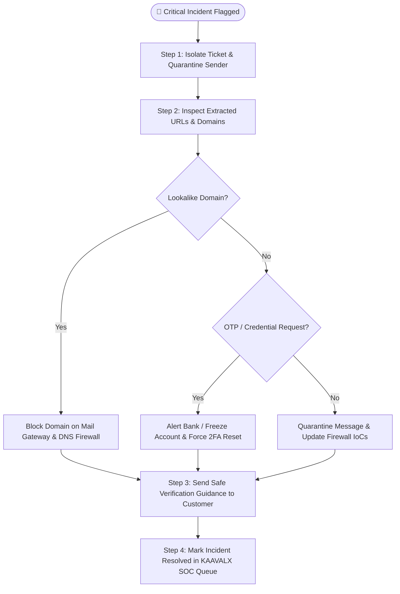

<div align="center">
  
  <h1>KAAVALX Enterprise Admin & SOC Panel Guide</h1>
  <p><strong>Comprehensive Operational Manual, Triage Workflows, and SOC Playbooks</strong></p>
  <p>
    
    <strong>Engineered by APEX</strong>
  </p>
</div>

---

## 📌 Document Overview

This guide provides an exhaustive, **A-to-Z operational walkthrough** of the **KAAVALX Enterprise Security Operations Center (SOC) & Customer Support Intelligence Admin Panel**. It covers all internal features, dashboards, triage workflows, AI copilot modes, database diagnostics, and threat remediation procedures available to SOC analysts, customer support managers, and system administrators.

---

## 📑 Table of Contents

1. [Access & Role-Based Authentication](#1-access--role-based-authentication)
2. [Global Navigation & Interface Architecture](#2-global-navigation--interface-architecture)
3. [Executive & SOC Overview Dashboard (`/dashboard`)](#3-executive--soc-overview-dashboard-dashboard)
4. [Master Conversation & Ticket Manager (`/conversations`)](#4-master-conversation--ticket-manager-conversations)
5. [Deep Conversation Inspector & Forensics (`/conversations/:id`)](#5-deep-conversation-inspector--forensics-conversationsid)
6. [Threat Intelligence & Phishing Triage Hub (`/threats`)](#6-threat-intelligence--phishing-triage-hub-threats)
7. [Live Interactive Conversation Analyzer (`/analyze`)](#7-live-interactive-conversation-analyzer-analyze)
8. [KAAVALX AI Copilot Studio (`/assistant`) & Floating Drawer](#8-kaavalx-ai-copilot-studio-assistant--floating-drawer)
9. [Dataset Inspector & Benchmark Seeder (`/dataset`)](#9-dataset-inspector--benchmark-seeder-dataset)
10. [System Settings, Telemetry & Diagnostics (`/settings`)](#10-system-settings-telemetry--diagnostics-settings)
11. [SOC Incident Response Playbooks & Remediation Steps](#11-soc-incident-response-playbooks--remediation-steps)
12. [Dual Database Synchronization (Supabase + SQLite)](#12-dual-database-synchronization-supabase--sqlite)

---

## 1. Access & Role-Based Authentication

### 1.1 Login Portal (`/login`)
The Admin & SOC Panel is protected by a secure client-side authentication gate with session persistence stored in browser local storage.

| Attribute | Value |
| :--- | :--- |
| **Route** | `http://localhost:5173/login` |
| **Default Administrator** | `kavalx@kavalx.in` |
| **Password** | *[Encrypted & Auto-filled]* |
| **Assigned Roles** | `SOC Lead`, `Incident Responder`, `Support Operations Manager` |

### 1.2 Quick Auto-Fill Demo Mode
For swift demonstration and auditing, the login interface features a one-click **"Auto Fill"** button that injects verified administrative credentials and immediately grants access to the dashboard.

### 1.3 Route Protection (`ProtectedRoute.jsx`)
All internal routes (`/dashboard`, `/conversations`, `/threats`, `/analyze`, `/assistant`, `/dataset`, `/settings`) are wrapped in `ProtectedRoute`. Unauthenticated requests are redirected to `/login`, while public requests default to `/verify`.

---

## 2. Global Navigation & Interface Architecture

The Admin Panel features a unified **App Shell Layout (`Layout.jsx`)** with responsive desktop/mobile components:

### 2.1 Collapsible Sidebar (`Sidebar.jsx`)
- **Brand Header**: Displays KAAVALX logo and active build tag.
- **Primary Navigation Links**:
  - 📊 **Dashboard** (`/dashboard`): High-level KPI metrics, velocity charts, and recent threats.
  - 💬 **Conversations** (`/conversations`): Paginated master log of all tickets.
  - 🛡️ **Threat Intelligence** (`/threats`): Dedicated cybersecurity incident triage.
  - ⚡ **Live Analyzer** (`/analyze`): Real-time analysis sandbox.
  - 🤖 **AI Assistant** (`/assistant`): Fullscreen Google Gemini 2.5 Flash copilot studio.
  - 📁 **Dataset** (`/dataset`): Raw JSON dataset manager and demo seeder.
  - ⚙️ **Settings** (`/settings`): Database health, API status, and theme preferences.
- **Public Scanner Shortcut**: Quick-switch button linking directly to the consumer `/verify` portal.
- **User Profile Footer**: Displays current analyst name, role pill, and **Sign Out** action.

### 2.2 Global Top Header (`Header.jsx`)
- **Breadcrumb Navigation**: Shows the current active module title.
- **Theme Toggle (`ThemeToggle.jsx`)**: Seamlessly switches between Dark Mode (Cyber SOC High-Contrast) and Light Mode.
- **AI Assistant Drawer Trigger**: Opens the draggable floating chat widget from any page.
- **User Avatar & Status Indicator**: Live green pulse showing backend database connectivity.

---

## 3. Executive & SOC Overview Dashboard (`/dashboard`)

The **Dashboard** aggregates live data from both Supabase PostgreSQL and local SQLite to provide real-time operational awareness for SOC leaders and support executives.

```
+----------------------------------------------------------------------------------------------------+
|                                      KAAVALX SOC DASHBOARD                                         |
+-------------------+--------------------+--------------------+-------------------+------------------+
| TOTAL TICKETS     | COMPLAINTS LOGGED  | CRITICAL THREATS   | UNRESOLVED ISSUES | THREAT RATIO     |
| 61                | 38                 | 14                 | 24                | 22.9%            |
+-------------------+--------------------+--------------------+-------------------+------------------+
|                                                                                                    |
|  [ SENTIMENT DISTRIBUTION ]         [ TICKET CATEGORIES ]          [ 14-DAY THREAT VELOCITY ]      |
|  Positive / Neutral / Negative      Billing, Tech, Security        Daily incident trend line       |
|                                                                                                    |
|  [ PRIORITY ALLOCATION ]            [ URGENCY VS SLA MATRIX ]      [ RECENT HIGH-RISK INCIDENTS ]  |
|  P1 / P2 / P3 / P4 Breakdown        Response times & SLAs          Live triage queue feed          |
+----------------------------------------------------------------------------------------------------+
```

### 3.1 Live KPI Telemetry Cards (`StatCard.jsx`)
1. **Total Conversations**: Count of all processed emails, chats, and contact forms.
2. **Customer Complaints**: Percentage and volume of negative/frustrated sentiment tickets requiring resolution.
3. **Critical Security Threats**: Count of verified phishing, lookalike domain, and credential exfiltration attacks.
4. **Unresolved Backlog**: Active tickets pending agent response or containment.
5. **Threat Detection Rate**: Proportion of incoming messages flagged with a risk score $\ge 50$.

### 3.2 Visual Recharts Analytics
- **Sentiment Polarity Donut Chart**: Proportions of `Positive`, `Neutral`, and `Negative` customer emotions.
- **Category Volume Bar Chart**: Distribution across `Billing & Payments`, `Technical Support`, `Order Fulfillment`, `Account & Security`, and `General Inquiry`.
- **14-Day Threat Velocity Trend Area Chart**: Time-series curve tracking daily attack volumes and severity spikes.
- **SLA Priority Matrix**: Visual split of `P1 Critical` ($< 1\text{hr}$ SLA), `P2 High`, `P3 Medium`, and `P4 Low` priority workloads.

### 3.3 Recent Threats Feed
A real-time list of the most recent critical security events displaying the sender email, threat type, risk score badge, and a direct link to the full forensic inspector.

---

## 4. Master Conversation & Ticket Manager (`/conversations`)

The **Conversations Page** provides a high-throughput data grid designed for support triage and incident investigation.

### 4.1 Search & Filtering Engine
- **Global Search**: Search instantly across customer names, email addresses, ticket reference IDs (`CONV-XXXX`), and message content.
- **Multi-Dimensional Dropdown Filters**:
  - **Category**: Filter by `Billing`, `Technical`, `Security`, etc.
  - **Sentiment**: Filter by `Positive`, `Neutral`, `Negative`.
  - **Urgency**: Filter by `Critical`, `High`, `Medium`, `Low`.
  - **Priority**: Filter by `P1`, `P2`, `P3`, `P4`.
  - **Resolution**: Filter by `Open`, `In Progress`, `Resolved`, `Closed`.
  - **Risk Level**: Filter by `CRITICAL`, `HIGH`, `MEDIUM`, `LOW`.
  - **Channel**: Filter by `Email`, `Chat`, `Support Ticket`, `Contact Form`, `Social Media`.

### 4.2 Data Table Columns
| Column | Description |
| :--- | :--- |
| **Reference / ID** | Formatted code (e.g. `CONV-1049`) linking to detail view |
| **Customer / Sender** | Full name and email address with channel badge |
| **Issue Summary** | Extracted core problem statement |
| **Category** | Color-coded category badge |
| **Sentiment** | Sentiment indicator (`Positive`, `Neutral`, `Negative`) |
| **Risk Level** | Cybersecurity threat level (`CRITICAL`, `HIGH`, `MEDIUM`, `LOW`) |
| **Priority** | Enterprise SLA priority tag |
| **Status** | Resolution lifecycle status (`Open`, `In Progress`, `Resolved`) |
| **Date** | Timestamp of interaction |
| **Actions** | Quick buttons: `View Details`, `Re-Analyze`, `Delete` |

### 4.3 Batch Actions & Pagination
Supports configurable page sizes (`10`, `25`, `50` records per page) with quick page-switching and total record counts.

---

## 5. Deep Conversation Inspector & Forensics (`/conversations/:id`)

Clicking any ticket loads the **Conversation Details Inspector**, presenting a dual-intelligence report:

### 5.1 Section 1: Customer Thread & Message History
- Displays the original customer message and historical back-and-forth communication.
- Displays metadata: Channel, Submission Timestamp, Customer Email, and Current Status.

### 5.2 Section 2: Customer Support Intelligence Card
- **Extracted Root Cause**: Concrete technical/billing issue summary.
- **Sentiment & Emotion Scoring**: Detailed emotional polarity (`Frustrated`, `Angry`, `Satisfied`, `Urgent`, `Calm`).
- **Urgency vs. SLA Priority**: Calculated urgency rating alongside recommended response SLA.
- **Resolution Status Tracker**: Dropdown allowing analysts to update ticket lifecycle status (`Open` $\rightarrow$ `In Progress` $\rightarrow$ `Resolved`).
- **AI Suggested Agent Draft**: Context-aware draft reply generated by AI, ready to copy and send to the customer.

### 5.3 Section 3: Cybersecurity Threat Intelligence Card
- **Threat Verdict Banner**: Displays `Threat Detected: YES/NO` with threat type categorization (`OTP Interception`, `Lookalike Typosquatting`, `Credential Harvesting`, `Clean Message`).
- **Visual Risk Meter**: Circular gauge displaying the deterministic score out of 100.
- **Forensic Flags**:
  - `Credential Theft`: Password or CVV requested.
  - `OTP Exfiltration`: 2FA verification code requested.
  - `Social Engineering`: Psychological panic or urgency language detected.
  - `Coercive Language`: Artificial deadline or legal threat detected.
- **Extracted URLs & Domain Breakdown**: Table of all web links found in the message with domain name, protocol (`http` vs `https`), IP host verification, lookalike homoglyph detection, and URL-specific risk scores.
- **SOC Containment Recommendation**: Concrete instructions for security teams (e.g. *"Block sender domain in mail gateway, revoke exposed session tokens, alert customer support"*).

---

## 6. Threat Intelligence & Phishing Triage Hub (`/threats`)

The **Threat Intelligence Portal** provides a dedicated threat-hunting environment for SOC analysts.

### 6.1 Threat Severity Matrix
- Categorizes all database records into four severity buckets:
  - 🔴 **CRITICAL (70–100 pts)**: Active credential theft, OTP exfiltration, or malicious lookalike domains.
  - 🟠 **HIGH (45–69 pts)**: Suspicious external links or account suspension demands.
  - 🟡 **MEDIUM (20–44 pts)**: Unverified domains or mild urgency language.
  - 🟢 **LOW (0–19 pts)**: Clean legitimate customer interactions.

### 6.2 Malicious Domain & Typosquatting Registry
- Lists all extracted domains across all tickets.
- Highlights homoglyph substitutions (e.g. replacing `l` with `1` in `paypa1.com` or `o` with `0` in `micros0ft.com`).
- Identifies raw IP hosts (e.g. `http://192.168.1.1/login`) and shortened URLs (`bit.ly`, `tinyurl.com`).

### 6.3 Social Engineering Attack Vectors
- Aggregates detected psychological attack vectors across the enterprise:
  - **Urgency & Panic**: *"Within 24 hours"*, *"Account suspended immediately"*.
  - **Authority Impersonation**: Spoofing bank managers, IT helpdesks, or law enforcement.
  - **Financial Lures**: Fake lottery winnings, unapproved refunds, or tax rebates.

---

## 7. Live Interactive Conversation Analyzer (`/analyze`)

The **Live Analyzer** allows analysts to test and simulate payloads in real time without writing permanent records to the database.

### 7.1 Input Form
- **Customer Information**: Customer Name, Email Address, Communication Channel (`Email`, `Chat`, `Support Ticket`, `Contact Form`, `Social Media`).
- **Message Content**: Paste raw text, suspicious email body, or chat logs.
- **Thread History**: Optional field to provide previous message exchanges for context.

### 7.2 Incident Triage Presets
Includes three built-in test scenarios:
1. **Billing & Refund Dispute**: Legitimate customer with duplicate transaction complaint.
2. **2FA & Credential Harvesting Attack**: High-risk phishing email requesting passwords and 6-digit OTP codes.
3. **Lookalike Impersonation Link**: Contact form submission containing a deceptive typosquatted domain.

### 7.3 Real-Time Report Generation
Submitting the form executes the unified `POST /api/analyze` engine and renders the full dual-intelligence grid (Customer NLP + SOC Threat Forensics) in under 500ms.

---

## 8. KAAVALX AI Copilot Studio (`/assistant`) & Floating Drawer

Powered by **Google Gemini 2.5 Flash**, the AI Copilot provides an intelligent natural-language interface across the application.

```
+----------------------------------------------------------------------------------------------------+
|                                    KAAVALX AI COPILOT STUDIO                                       |
+----------------------------------------------------------------------------------------------------+
|  MODE SELECTOR:                                                                                    |
|  [ 🛡️ SOC Threat Hunting ]       [ 💬 Customer Support Copilot ]       [ 📊 Ask Database Telemetry ]|
+----------------------------------------------------------------------------------------------------+
|                                                                                                    |
|  CHAT STREAM:                                                                                      |
|  User: "Analyze this email header: Received from mail-out.paypa1-security.example (IP: 45.33.32.1)" |
|                                                                                                    |
|  KAAVALX AI:                                                                                       |
|  🚨 THREAT DETECTED: Lookalike Typosquatting Phishing Attack                                       |
|  1. Sender domain uses homoglyph '1' replacing 'l' in PayPal.                                      |
|  2. Originating IP is associated with an unverified VPS host.                                      |
|  3. Recommended Action: Block CIDR block, quarantine inbound emails, reset user credentials.       |
|                                                                                                    |
+----------------------------------------------------------------------------------------------------+
|  [ Quick Prompt Chips: "Extract IoCs" | "Draft SLA Refund Reply" | "Show Today's Critical Threats" ]|
|  [ Enter message or prompt...                                                            ] [ SEND ]|
+----------------------------------------------------------------------------------------------------+
```

### 8.1 Tri-Mode Architecture
1. 🛡️ **SOC Threat Analyst Mode**:
   - Paste raw headers, malware payloads, URLs, or phishing lures.
   - Outputs: Indicators of Compromise (IoCs), MITRE ATT&CK technique mapping, and containment playbooks.
2. 💬 **Customer Support Copilot Mode**:
   - Draft empathetic, policy-compliant responses for distressed customers.
   - Generates step-by-step refund steps and SLA escalation workflows.
3. 📊 **Ask Database Telemetry Mode**:
   - Queries live Supabase PostgreSQL & SQLite data in plain English.
   - Examples: *"How many critical threats were logged today?"*, *"List top 5 unresolved billing issues"*, *"What is the threat detection rate this week?"*.

### 8.2 Global Floating Chat Drawer (`FloatingChatWidget.jsx`)
- Accessible via the circular bot button on any admin page.
- Allows analysts to query the AI without navigating away from active ticket queues.

---

## 9. Dataset Inspector & Benchmark Seeder (`/dataset`)

The **Dataset Manager** gives administrators complete control over training benchmarks and evaluation records.

### 9.1 Features:
- **Raw JSON Inspector**: View structured conversation records, sentiment labels, threat classifications, and URL telemetry.
- **60+ Enterprise Seed Cases**: Built-in benchmark dataset covering e-commerce complaints, SaaS outages, banking fraud, and credential phishing.
- **One-Click Re-Seeding (`POST /api/demo/seed`)**: Resets and repopulates the database with clean benchmark records for testing and demos.
- **Export Capabilities**: Export records to JSON for external fine-tuning and compliance audits.

---

## 10. System Settings, Telemetry & Diagnostics (`/settings`)

The **Settings Module** provides health monitors and database administration utilities.

### 10.1 Diagnostics Panel:
- **Supabase Cloud PostgreSQL Status**: Live connection status, project URL, and query round-trip latency in milliseconds.
- **Local SQLite Status**: Database file path (`./data/app.db`), WAL journal mode status, and integrity check.
- **AI Model Status**: Status indicator for Google Gemini 2.5 Flash and Claude fallback heuristics.
- **Server Health Check (`GET /api/health`)**: Server uptime, port configuration, and process memory utilization.

### 10.2 Administrative Actions:
- **Sync to Supabase**: Triggers background migration replicating local SQLite tickets to Supabase Cloud PostgreSQL.
- **Purge Cache / Reset Database**: Safely clears temporary session tokens and cached analytics metrics.

---

## 11. SOC Incident Response Playbooks & Remediation Steps

When a ticket is flagged with a **HIGH** or **CRITICAL** risk score, SOC analysts should execute the following standardized containment playbook:



### Playbook Checklist:
1. **Immediate Quarantine**: Mark the ticket as `In Progress` and flag the sender email address in your inbound mail gateway (e.g. Proofpoint, Mimecast, Google Workspace).
2. **IoC Extraction**: Copy the extracted domain, raw IP, and URL hashes from the Threat Intelligence card into your enterprise firewall blocklist.
3. **Credential & Account Protection**: If OTP or password harvesting was detected, contact the customer via verified secondary channel (phone/SMS) to advise immediate password change and 2FA reset.
4. **Customer Communication**: Use the AI Copilot to generate a safety advisory email explaining why the message was fraudulent.
5. **Incident Closure**: Update the resolution status to `Resolved` in KAAVALX with incident notes.

---

## 12. Dual Database Synchronization (Supabase + SQLite)

KAAVALX operates with dual-database synchronization to ensure 100% uptime:

### 12.1 Operational Behavior:
- **Primary Cloud DB**: **Supabase PostgreSQL** provides centralized cloud data storage for production deployments.
- **Local Fallback DB**: **SQLite 3** (`better-sqlite3` in WAL mode) guarantees offline functionality during local development or network disruptions.
- **Data Parity**: Tables (`conversations`, `analyses`, `threats`, `urls`, `emails`) share identical schemas and foreign key cascades across both engines.

### 12.2 Syncing Local Data to Supabase Cloud:
To replicate local tickets and threat analyses to Supabase Cloud, run:
```bash
cd server
npm run db:sync:supabase
```
This utility reads all local SQLite tables, validates foreign key constraints, and synchronizes records into your Supabase PostgreSQL instance via upsert queries.

---

<div align="center">
  <br/>
  <p><strong>KAAVALX Enterprise SOC Admin Platform</strong> • Engineered by <strong>APEX</strong></p>
  
</div>
