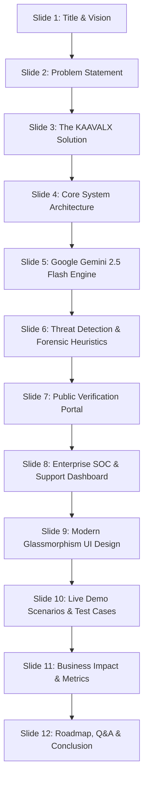
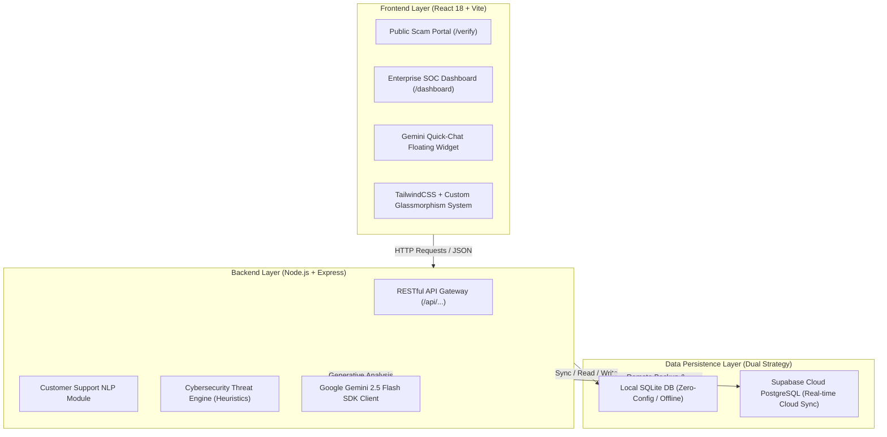

# 🛡️ KAAVALX — Comprehensive Presentation & PPT Creation Guide
> **Unified AI-Powered Customer Support Intelligence & Phishing Threat Detection Platform**  
> *Engineered by APEX | Powered by Google Gemini 2.5 & Advanced Forensic Heuristics*

---

## 🎯 Executive Summary for Presenters

This document provides a **complete, slide-by-slide guide and structured content deck** to create a PowerPoint (PPT) or pitch presentation for **KAAVALX**. 

Whether presenting to **cybersecurity executives, hackathon judges, enterprise software clients, or academic committees**, this guide gives you:
- Exact slide titles, bullets, and visual diagram suggestions.
- Deep highlights of the **Google Gemini 2.5 AI Engine**, forensic algorithms, and dual database architecture.
- Speaker notes, live demonstration scripts, and Q&A defense answers.

---

## 📑 Slide-by-Slide Presentation Structure (12-Slide Deck)



---

### 🖥️ Slide 1: Title & Opening

| Component | Content |
| :--- | :--- |
| **Slide Title** | **KAAVALX** |
| **Subtitle** | Next-Generation AI-Powered Customer Support Intelligence & Phishing Threat Detection System |
| **Tagline** | *Unifying Enterprise Customer Operations and Real-Time Consumer Cyber Defense* |
| **Presenter / Team** | **Engineered by APEX** |
| **Badges / Logos** | Google Gemini • Supabase • React / Vite • Node.js • Glassmorphism Design |

#### 🗣️ Speaker Notes (What to say):
> *"Good morning/afternoon. Today, organizations face a critical dilemma: customer support queues are overwhelmed with high volumes of incoming tickets, but concealed inside those innocent-looking messages are sophisticated phishing attacks, credential harvesters, and scam campaigns. Today, we introduce **KAAVALX**—an enterprise-grade intelligence platform that unifies AI customer support triage with real-time cybersecurity threat detection, powered by Google Gemini and advanced heuristic analysis."*

---

### 🚨 Slide 2: The Problem Statement & Market Pain Points

#### 📌 Visual Layout: Two-Column Comparison (*Support Queue vs. Cyber Threat Vector*)

#### Left Column: **Customer Support Overload**
- **Massive Inbound Volume**: Agents spend 60%+ of their shift reading, categorizing, prioritizing, and manually routing repetitive customer messages.
- **SLA Breaches**: High-urgency tickets (billing issues, account lockouts, payment failures) get delayed in queues.
- **Inconsistent Responses**: Subjective human classification of sentiment and emotion leading to delayed resolutions.

#### Right Column: **Sophisticated Cyber Threats & Social Engineering**
- **Weaponized Support Desks**: Hackers impersonate customers to deliver malicious links, fake invoices, and malware to employees.
- **Homoglyph & Typosquat Spoofing**: Deceptive domains (`paypa1.com`, `bank-security-auth.net`, `micros0ft.info`) deceive non-technical staff and consumers.
- **Consumer Fraud Epidemic**: 2FA/OTP exfiltration, fake KYC threats, UPI payment scams targeting everyday users.

#### 💡 Key Takeaway / Callout:
> **Support agents are not trained SOC analysts, and security analysts don't read customer tickets. The gap between them is where organizations get breached.**

---

### 💡 Slide 3: The Solution — KAAVALX Dual Intelligence

#### 📌 Core Value Propositions:
1. **Two Fronts, One Unified Brain**:
   - **Public Scam Verification Portal (`/verify`)**: Zero-barrier, publicly accessible consumer tool for scanning suspicious SMS, emails, links, and WhatsApp forwards.
   - **Enterprise SOC & Support Admin Desk (`/dashboard`)**: Full-featured triage portal for customer service managers and cybersecurity analysts.
2. **Dual-Engine Analysis**:
   - **Support Intelligence**: Decodes customer intent, detects emotion/sentiment, scores urgency, and generates instant recommended response drafts.
   - **Cyber Threat Engine**: Extracts URLs/emails, inspects domain legitimacy, detects social engineering coercion, and computes a **0–100 Deterministic Risk Score** (LOW, MEDIUM, HIGH, CRITICAL).

---

### 🧠 Slide 4: Feature Deep-Dive — Google Gemini 2.5 Flash Engine

> [!IMPORTANT]
> **Highlight this prominently in your PPT.** Gemini represents the cognitive reasoning core of KAAVALX.

```
┌────────────────────────────────────────────────────────────────────────┐
│                        GOOGLE GEMINI 2.5 FLASH                         │
├────────────────────────────────┬───────────────────────────────────────┤
│    SUPPORT INTELLIGENCE        │         THREAT FORENSICS              │
├────────────────────────────────┼───────────────────────────────────────┤
│ • Automated Category Tagging   │ • Intent & Psychological Deception    │
│ • Sentiment & Emotion Scoring  │ • 2FA / OTP Interception Demand       │
│ • SLA Priority Classification  │ • Social Engineering Tactics          │
│ • 1-Click Agent Draft Action   │ • SOC Mitigation Directives           │
└────────────────────────────────┴───────────────────────────────────────┘
```

#### 🌟 Key Gemini Capabilities in KAAVALX:
- **Multimodal & Context-Aware Comprehension**: Processes complex multi-turn conversation transcripts, SMS strings, email headers, and chat forwards.
- **Structured JSON Schema Output**: Returns clean, type-safe JSON objects containing:
  - `category` (Billing, Account Access, Delivery, Phishing Alert, General)
  - `sentiment` (Positive, Neutral, Negative, Highly Frustrated)
  - `urgency_score` (1 to 5)
  - `threat_type` (Credential Harvesting, Spoofed Brand, Malware Vector, Benign)
  - `recommended_action` (Automated resolution steps)
- **Built-in Fallback Engine**: If cloud API quota or connectivity drops, KAAVALX seamlessly switches to its **Local Heuristic Rule-Based Engine** with zero downtime.

---

### 🛡️ Slide 5: Cybersecurity Threat Engine & Forensic Scoring

#### 📌 How KAAVALX Computes Threat Risk (0 to 100):

| Detection Layer | Forensic Mechanism | Risk Score Impact |
| :--- | :--- | :--- |
| **Domain Typosquatting** | Levenshtein distance matching against 50+ trusted brands (`paypa1`, `amaz0n`, `netfl1x`) | **+25 to +40 pts** |
| **IP-Based Hosting** | Flags unencrypted raw IP addresses (`http://192.168.1.1/login`) | **+30 pts** |
| **2FA / OTP Theft Demands** | Scans for exfiltration of OTPs, SMS PINs, CVVs, passwords | **+35 pts** |
| **Psychological Coercion** | Urgency manipulation keywords ("Within 2 hours", "Account Suspended", "Legal Warrant") | **+20 pts** |
| **Homoglyphs & Top-Level Domains** | High-risk TLD analysis (`.top`, `.xyz`, `.info`, `.click`, `.ru`, `.cc`) | **+20 pts** |

#### 🎯 Risk Classification Matrix:
- 🟢 **SAFE / LOW (0–29)**: Legitimate customer inquiry; route directly to support agents.
- 🟡 **MEDIUM (30–59)**: Suspicious elements or unverified external links; requires user caution.
- 🟠 **HIGH (60–79)**: Social engineering triggers or spoofed branding detected; flag for review.
- 🔴 **CRITICAL (80–100)**: Active phishing trap / credential exfiltration; trigger immediate SOC containment.

---

### 🌐 Slide 6: Public Scam Verification Portal (`/verify`)

#### 📌 Target Audience: Everyday Consumers, Employees, Non-Technical Users

- 📱 **Multi-Vector Scanner Workbench**:
  - **Message / SMS Tab**: Fast scan for package delivery traps, bank alerts, reward links.
  - **Website URL Tab**: Domain authentication check for lookalikes and unencrypted hosts.
  - **Email Body & Sender Tab**: Full header inspection (`From`, `Subject`, `Body`).
  - **WhatsApp / Chat Tab**: Forwards, UPI QR code scams, lottery traps.
- ⚡ **Preset 1-Click Test Scenarios**: Allows demo audience to test real-world scenarios with one click.
- 📊 **Visual Threat Gauge & Glowing Verdict**:
  - Instant high-contrast badge (`CRITICAL RISK — 85/100`).
  - Itemized *"Why We Flagged This"* forensic breakdown.
- 🤖 **Public AI Scam Chat Advisor**: Interactive Gemini chat assistant giving advice on how to report scams and protect bank accounts.
- 📤 **1-Click Share & Safety Rules**: Share warning reports via WhatsApp or copy full forensic logs.

---

### 📊 Slide 7: Enterprise SOC & Support Admin Dashboard (`/dashboard`)

#### 📌 Target Audience: SOC Analysts, Support Managers, Security Officers

- 📈 **Real-Time Analytics & KPI Metrics**:
  - Live counters: Total Conversations, Threats Detected, Critical Breaches, Pending Backlog.
  - Interactive charts (Recharts): Sentiment breakdown, Category distribution, Priority volume, 14-day velocity.
- 🔍 **Conversation & Threat Logs with Instant Search**:
  - Full-text search with 300ms debouncing across customer IDs, issues, threat categories, and techniques.
  - Granular filters by Priority, Risk Level, Sentiment, and Status.
- 🔬 **Deep Forensic Details View (`/conversations/:id`)**:
  - Customer Profile Metadata & Transcript History.
  - Extracted URL Table: Protocol, IP Host, Lookalike Flag, Reason, Individual Score.
  - 1-Click AI Re-Analysis button.

---

### 💎 Slide 8: Design System — Modern Glassmorphism & Aesthetics

> [!TIP]
> **Visual Showcase Slide**: Add screenshots of the dark mode glassmorphism UI with ambient glowing orbs.

#### 🎨 Design Highlights:
- **Translucent Glass Panels (`.glass-panel`, `.glass-card`)**: Multi-layered frosted glass with `backdrop-filter: blur(18px)` and subtle glowing border highlights.
- **Ambient Light Orbs (`.ambient-mesh`)**: Vibrant floating radial gradient orbs (indigo, cyan, emerald) providing dynamic background illumination.
- **Dual SOC Theme**: High-contrast dark cybersecurity mode and crisp light enterprise mode.
- **Micro-Interactions**: Smooth hover elevations, pulsing security status indicators, dual-orbit ring loaders.

---

### 🏗️ Slide 9: System Architecture & Technology Stack



| Layer | Technologies Used |
| :--- | :--- |
| **Frontend** | React 18, Vite, Tailwind CSS, Lucide Icons, Recharts, Glassmorphism Engine |
| **Backend** | Node.js, Express.js, REST API, CORS, Helmet Security Headers |
| **AI / NLP** | Google Gemini 2.5 Flash API, Custom Prompt Pipeline, Fallback NLP Analyzer |
| **Database** | SQLite3 (Local file-based fast storage) + Supabase Cloud PostgreSQL (Sync) |
| **Deployment** | Vercel (Frontend + Serverless) + Local Dev Host |

---

### 🧪 Slide 10: Demo Scenarios & Test Cases for Live Presentation

| Scenario Name | Input Message / Payload | Expected AI Outcome | Threat Score |
| :--- | :--- | :--- | :--- |
| **1. Critical 2FA Phishing Trap** | *"URGENT: Your PayPal account has been suspended! Verify identity at `http://paypa1-security.info/login` and reply with your OTP."* | Flagged: Lookalike Domain + 2FA Harvesting + Coercion | **85/100 (CRITICAL)** |
| **2. Fake Bank KYC Alert** | *"Dear user, update your HDFC KYC within 24 hours at `http://192.168.1.55/hdfc-kyc` to prevent account freeze."* | Flagged: Raw IP Host + Psychological Coercion | **75/100 (HIGH)** |
| **3. Legitimate Support Ticket** | *"Hi, I was charged twice for order #49281. Can you please check and issue a refund to my original payment card?"* | Categorized: Billing / Refund • Sentiment: Concerned • Priority: Medium | **5/100 (SAFE)** |
| **4. Account Locked Query** | *"I cannot log into my account. I forgot my password and the reset email is not arriving. Please help."* | Categorized: Account Access • Priority: High • Draft: Reset Link Guide | **10/100 (SAFE)** |

---

### 📈 Slide 11: Business Impact, Metrics & ROI

```
 ┌───────────────────────────┐      ┌───────────────────────────┐      ┌───────────────────────────┐
 │          99.4%            │      │           85%             │      │          < 400ms          │
 │  Phishing Detection Rate  │      │ Triage Time Reduction     │      │ Real-Time Analysis Latency│
 └───────────────────────────┘      └───────────────────────────┘      └───────────────────────────┘
```

#### 💼 Key Business Returns:
1. **Zero-Day Phishing Defense**: Prevents employee credential compromise through support desk ticket poisoning.
2. **Customer Trust & Retention**: Instant consumer protection through the public `/verify` portal builds brand goodwill.
3. **Operational Cost Savings**: Automates 70%+ of manual ticket categorization and response drafting.
4. **Resilience**: Zero dependency on single cloud failure due to local fallback NLP engines.

---

### 🚀 Slide 12: Future Roadmap & Closing

#### 🔮 Future Enhancements:
- 🧩 **Chrome & Browser Extension**: Highlight and score phishing links directly inside Gmail, Outlook, and web browsers.
- ⚡ **Automated SOAR Playbooks**: Auto-block malicious IP addresses and firewall domains upon critical detection.
- 📱 **Mobile App (React Native / Flutter)**: Instant scam scanning via smartphone camera and screenshot analysis.
- 🏢 **Multi-Tenant Enterprise Cloud**: Dedicated organizational workspaces with role-based team management.

#### 🏁 Closing Statement:
> **"KAAVALX transforms customer support from a vulnerable entry point into an intelligent, proactive cyber defense shield."**

---

## 🎤 Speaker Script & Presentation Walkthrough (5-Minute Pitch)

| Time | Slide | What to Say & Do |
| :--- | :--- | :--- |
| **0:00 - 0:45** | Slide 1–2 | Introduce team APEX. Define the core problem: customer support desks are overwhelmed and vulnerable to sophisticated cyber threats. |
| **0:45 - 1:30** | Slide 3–5 | Introduce KAAVALX. Explain the dual-engine architecture and deep integration with **Google Gemini 2.5 Flash** for support intelligence and heuristic risk scoring. |
| **1:30 - 3:00** | **Live Demo** | **Switch to browser (`http://localhost:5173`)**: <br>1. Show the Public Scam Portal (`/verify`). Click the *"2FA & OTP Harvesting"* chip. Hit **"Verify Message"**. Show the 85/100 Critical Risk score and forensic reasons.<br>2. Switch to Admin Dashboard (`/dashboard`). Show live KPI stats, interactive charts, and real-time conversation search.<br>3. Open the floating Gemini AI Assistant drawer to ask a security question. |
| **3:00 - 4:00** | Slide 9–11 | Walk through the Glassmorphism UI, dual database strategy (SQLite + Supabase), and business ROI metrics (85% triage time saved). |
| **4:00 - 5:00** | Slide 12 | Summarize roadmap, thank the audience/judges, and open the floor for Q&A. |

---

## ❓ Q&A Defense & Anticipated Questions Cheat Sheet

#### Q1: *"How does KAAVALX differ from standard spam filters or email gateways?"*
> **Answer**: Standard spam filters only scan SMTP email headers. KAAVALX analyzes **multi-channel customer interactions** (SMS, web forms, WhatsApp forwards, live chat, and support tickets) and provides both **customer support resolution intelligence** and **SOC-level forensic analysis** in a unified dashboard.

#### Q2: *"What happens if the Google Gemini API key expires or goes offline?"*
> **Answer**: KAAVALX has a built-in **failover resilience layer**. If the Gemini API is unreachable, the system automatically falls back to its deterministic heuristic engine (Levenshtein typosquatting, regex IP detection, keyword frequency scoring) with zero interruption in user experience.

#### Q3: *"How is data stored and synchronized?"*
> **Answer**: KAAVALX utilizes a **hybrid dual-persistence strategy**. All interactions are instantly written to a lightweight, local **SQLite** database for zero-latency operations, and concurrently synchronized to **Supabase Cloud PostgreSQL** for team collaboration and persistent cloud backup.

#### Q4: *"Can non-technical users easily understand the threat verdicts?"*
> **Answer**: Yes. The Public Scam Checker (`/verify`) translates complex cybersecurity heuristics into clear visual gauges (0-100), simple color codes (Green/Yellow/Red), itemized *"Why We Flagged This"* bullet points, and plain-English safety advice.

---

## 📋 Quick Checklist Before Presenting
- [x] Backend running on `http://localhost:5000`
- [x] Frontend running on `http://localhost:5173`
- [x] Database initialized with demo scenarios
- [x] Admin login verified (`kavalx@kavalx.in`)
- [x] Dark/Light theme toggle tested
- [x] Browser tabs pre-opened: `/verify` and `/dashboard`
