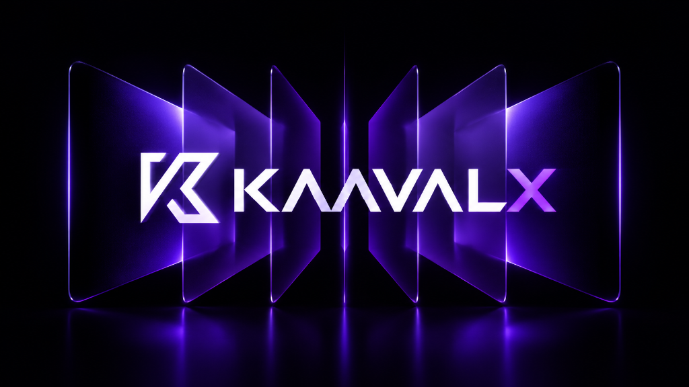
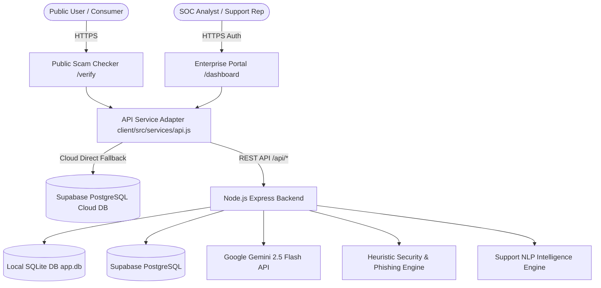

<div align="center">
  
  <h1>KAAVALX</h1>
  <p><strong>AI-Powered Customer Support Intelligence & Phishing Threat Detection System</strong></p>
  <p>
    
    <strong>Developed by APEX</strong>
  </p>
</div>

[](https://ai-powered-customer-support-intelli.vercel.app/)
[](http://localhost:5173/verify)
[](VERIFY_PORTAL_GUIDE.md)
[](ADMIN_PANEL_GUIDE.md)
[](https://supabase.com)
[](https://ai.google.dev/)
[](https://vitejs.dev/)
[](https://nodejs.org/)

> **An enterprise-grade, full-stack intelligence platform that unifies AI-driven Customer Support Ticket Analysis with Automated Real-Time Cybersecurity Phishing Threat Detection, Public Consumer Scam Verification, and SOC Triage.**
>
> 🛡️ *[Public Scam Checker Operational Guide (VERIFY_PORTAL_GUIDE.md)](VERIFY_PORTAL_GUIDE.md)* • 📊 *[Admin & SOC Panel Operational Manual (ADMIN_PANEL_GUIDE.md)](ADMIN_PANEL_GUIDE.md)*

---

## 📌 Table of Contents
1. [System Overview & Value Proposition](#1-system-overview--value-proposition)
2. [Public Scam Verification Portal (`/verify`)](#2-public-scam-verification-portal-verify)
3. [Public Scam Checker Guide (`VERIFY_PORTAL_GUIDE.md`)](VERIFY_PORTAL_GUIDE.md)
4. [Enterprise SOC & Support Dashboard](#3-enterprise-soc--support-dashboard)
5. [Admin & SOC Panel Operational Manual (`ADMIN_PANEL_GUIDE.md`)](ADMIN_PANEL_GUIDE.md)
6. [Live Demo & Login Credentials](#4-live-demo--login-credentials)
7. [System Architecture & Tech Stack](#5-system-architecture--tech-stack)
8. [Database Schema (Supabase PostgreSQL & SQLite)](#6-database-schema)
9. [Cybersecurity & Phishing Detection Engine](#7-cybersecurity--phishing-detection-engine)
10. [Customer Support NLP & Intelligence Engine](#8-customer-support-nlp--intelligence-engine)
11. [AI Copilot Studio & Public Scam Advisor](#9-ai-copilot-studio--public-scam-advisor)
12. [Complete REST API Documentation](#10-complete-rest-api-documentation)
13. [Local Development & Installation Guide](#11-local-development--installation-guide)
14. [Supabase Cloud Setup & Data Migration](#12-supabase-cloud-setup--data-migration)
15. [Vercel Deployment Guide](#13-vercel-deployment-guide)
16. [Project Directory Structure](#14-project-directory-structure)
17. [Demo Scenarios & Test Cases](#15-demo-scenarios--test-cases)
18. [License & Acknowledgments](#16-license--acknowledgments)

---

## 1. System Overview & Value Proposition

Enterprise customer support desks face tens of thousands of incoming customer inquiries, emails, chats, and contact forms every day. Among legitimate high-priority complaints (such as duplicate billing, delayed package deliveries, refund disputes, and account locked issues) lurk sophisticated **adversary campaigns**:
- **Phishing attacks** impersonating trusted brands (PayPal, Microsoft, Netflix, Apple, Banks).
- **Homoglyph & lookalike domain spoofing** (e.g. `paypa1-security.example`, `micros0ft-update.info`).
- **Credential harvesting forms** designed to steal credentials, CVV codes, and passwords.
- **2FA/OTP exfiltration** and psychological urgency coercion tactics.

**KAAVALX** solves both enterprise support challenges and consumer fraud defense simultaneously:
1. **Public Scam Verification (`/verify`)**: A clean, accessible consumer portal allowing anyone to scan suspicious messages, SMS, website URLs, emails, or WhatsApp forwards without needing an account.
2. **Customer Support Intelligence**: Decodes what the customer is asking, categorizes the issue, detects sentiment & emotional urgency, monitors SLA priority, and recommends automated agent response drafts.
3. **Cybersecurity Intelligence**: Extracts embedded links/emails, checks lookalike typosquatting and unencrypted IP hosts, flags social engineering tactics, computes a deterministic **Risk Score (0–100)** with assigned **Risk Level (LOW / MEDIUM / HIGH / CRITICAL)**, and provides actionable **SOC Containment Recommendations**.

---

## 2. Public Scam Verification Portal (`/verify`)

The **Public Scam Checker** serves as the default public entrypoint (`/` redirects directly to `/verify`):

### Key Capabilities:
- 📱 **Multi-Mode Input Workbench**:
  - **Message / SMS**: Scan raw SMS notifications, delivery updates, or customer texts.
  - **Website URL / Link**: Dedicated URL scanner for domain typosquatting, raw IP hosting, and credential submission endpoints.
  - **Email Body & Sender**: Multi-field input for `From: (Sender Email)`, `Subject Line`, and full `Email Body`.
  - **WhatsApp / Chat**: Dedicated chat forward scanner for fake UPI claims, lottery traps, and KYC threats.
- ⚡ **Compact Preset Scenario Chips**: One-click chips to load live test scenarios (`2FA & OTP Harvesting Trap`, `Fake Bank Typosquat Link`, `WhatsApp KYC Suspension Alert`, `Billing Refund Query`, `Amazon Order Delivery`).
- 🎯 **Strong Visual Threat-Score Result Screen**:
  - Prominent high-contrast threat verdict banner with status icons.
  - Bold threat score gauge (`Score: 85/100 - CRITICAL RISK` vs `Score: 10/100 - SAFE`).
  - Animated glowing progress bar matching severity.
- 🧠 **"Why We Flagged This" AI Forensic Breakdown**:
  - Itemized forensic breakdown displaying exact reasons why a message was flagged (e.g., *2FA/OTP Interception Demand (+35 pts)*, *Credential Harvesting (+30 pts)*, *Urgency Coercion (+20 pts)*, *Lookalike Typosquatting (+25 pts)*).
  - Quick-indicator badges for Credential Theft, OTP Trap, Psychological Panic, and Typosquat URLs.
- 🤖 **Public AI Scam Chat Advisor**:
  - Interactive chatbot built into the page (and accessible via floating drawer) to answer user questions about online fraud, OTP rules, bank UPI safety, and emergency response steps.
- 🛡️ **Safety Rules & Interactive FAQs**:
  - 4 core rules to prevent fraud (OTP protection, URL inspection, urgency avoidance, UPI PIN receiving rules) plus expandable FAQ accordion.
- 📋 **Share & Report Tools**: One-click clipboard copy for full incident reports and instant WhatsApp/SMS warning share links.

---

## 3. Enterprise SOC & Support Dashboard

The internal analyst platform (`/dashboard`) provides end-to-end security incident response and support operations:

- 🔐 **Role-Based Authentication**: Secure authentication gate with session persistence in local storage and rapid demo auto-fill credentials.
- 🌓 **Dynamic Theme Switching (Dark & Light Mode)**: Full-featured dark/light theme toggle with high-contrast cybersecurity SOC aesthetics and persistent user preference.
- 📊 **Executive & SOC Dashboard**:
  - Live KPI metrics (Total Conversations, Total Complaints, Critical Cases, Unresolved Backlog, Threats Detected).
  - Interactive charts powered by Recharts (Sentiment distributions, Category volume, Priority allocation, Threat vectors, 14-day velocity trends).
- 🔍 **Deep Inspection & Triage**:
  - Filterable conversation logs with keyword search, priority sorting, sentiment filters, and risk tags.
  - Dedicated **Threat Intelligence** portal detailing lookalike domains, shortened URLs, and social engineering indicators.
- 🧪 **Live Conversation Analyzer (`/analyze`)**:
  - Interactive workbench with pre-loaded attack payloads and customer complaint scenarios.
  - Generates instant dual-intelligence breakdown: Customer Support NLP metrics and SOC Security Forensics.
- 🤖 **Fullscreen AI Copilot Studio (`/assistant`)**:
  - Tri-mode chat environment (SOC Threat Hunting, Customer Support Copilot, and Live Database Telemetry).

---

## 4. Live Demo & Login Credentials

| Attribute | Details |
| :--- | :--- |
| **Live Deployed App** | [https://ai-powered-customer-support-intelli.vercel.app/](https://ai-powered-customer-support-intelli.vercel.app/) |
| **Public Scam Checker** | [https://ai-powered-customer-support-intelli.vercel.app/verify](https://ai-powered-customer-support-intelli.vercel.app/verify) |
| **Default User** | `kavalx@kavalx.in` |
| **Password** | *[Encrypted & Auto-filled directly on login]* |
| **Role** | `SOC Incident Responder & Admin` |

> *Tip: To access the internal dashboard, click **"SOC Portal"** on the `/verify` page, then click **"Auto Fill"** on the login screen to sign in instantly.*

---

## 5. System Architecture & Tech Stack



### Technology Breakdown:
- **Frontend**: React 18, Vite 6, Tailwind CSS 3, Recharts, Lucide Icons, React Router v6.
- **Backend**: Node.js, Express.js, CORS, Dotenv, Better-SQLite3.
- **AI & LLM**: Google Gemini 2.5 Flash (`@google/genai`), Anthropic Claude 3.5 Sonnet (`@anthropic-ai/sdk`).
- **Cloud Database**: Supabase PostgreSQL (`@supabase/supabase-js`).
- **Local Database**: SQLite 3 (`better-sqlite3` in WAL mode).
- **Deployment**: Vercel (Frontend SPA) + Node server / Render / Railway (Backend).

---

## 6. Database Schema

The database schema is fully mirrored across both **Supabase PostgreSQL** and **SQLite**:

### 1. `conversations` Table
Stores raw communication records from email, live chat, or tickets.
| Column | Type | Description |
| :--- | :--- | :--- |
| `id` | BIGINT / INTEGER PRIMARY KEY | Unique ID |
| `external_id` | TEXT UNIQUE | Ticket reference code (e.g. `CONV-1726654800`) |
| `customer_name` | TEXT | Customer or Sender name |
| `customer_email` | TEXT | Customer or Sender email address |
| `channel` | TEXT | `Email`, `Chat`, `Support Ticket`, `Contact Form`, `Social Media` |
| `message` | TEXT | Body content of the message |
| `conversation_history`| TEXT | Thread history if applicable |
| `status` | TEXT | `Open`, `In Progress`, `Resolved`, `Closed` |
| `created_at` | TIMESTAMPTZ | Timestamp of receipt |

### 2. `analyses` Table
Stores extracted customer support NLP intelligence.
| Column | Type | Description |
| :--- | :--- | :--- |
| `id` | BIGINT / INTEGER PRIMARY KEY | Unique ID |
| `conversation_id` | BIGINT FK | References `conversations(id)` |
| `category` | TEXT | `Billing & Payments`, `Technical Support`, `Order Fulfillment`, `Account & Security`, `General Inquiry` |
| `issue` | TEXT | Specific problem summary |
| `sentiment` | TEXT | `Positive`, `Neutral`, `Negative` |
| `emotion` | TEXT | `Frustrated`, `Angry`, `Satisfied`, `Urgent`, `Calm` |
| `urgency` | TEXT | `Low`, `Medium`, `High`, `Critical` |
| `priority` | TEXT | `Low`, `Medium`, `High`, `Critical` |
| `customer_request` | TEXT | Action requested by user |
| `resolution_status` | TEXT | `Resolved`, `Unresolved`, `Pending` |
| `recommended_action` | TEXT | Guidance for customer support rep |
| `confidence` | REAL | Model confidence (0.0 to 1.0) |

### 3. `threats` Table
Stores cybersecurity risk metrics and phishing telemetry.
| Column | Type | Description |
| :--- | :--- | :--- |
| `id` | BIGINT / INTEGER PRIMARY KEY | Unique ID |
| `conversation_id` | BIGINT FK | References `conversations(id)` |
| `threat_detected` | INTEGER | `1` (Threat) or `0` (Clean) |
| `threat_type` | TEXT | `Phishing Attack`, `Credential Harvesting`, `Lookalike Domain Scam`, `None` |
| `risk_level` | TEXT | `LOW`, `MEDIUM`, `HIGH`, `CRITICAL` |
| `risk_score` | INTEGER | Computed score (`0` to `100`) |
| `social_engineering` | INTEGER | Boolean flag for manipulative tactics |
| `social_engineering_techniques` | TEXT | Techniques detected (e.g. `Urgency; Scarcity; Impersonation`) |
| `credential_request` | INTEGER | Flag for password/pin requests |
| `otp_request` | INTEGER | Flag for one-time-password harvesting |
| `reason` | TEXT | Explanatory SOC breakdown |
| `recommended_action` | TEXT | SOC incident containment step |

### 4. `urls` Table & 5. `emails` Table
Stores parsed domains, hostnames, protocol analysis (`http` vs `https`), IP hosts, and homoglyph mismatch scores.

---

## 7. Cybersecurity & Phishing Detection Engine

KAAVALX uses a multi-layered detection matrix combining deterministic structural heuristics with AI:

### Risk Calculation Matrix:
| Indicator | Heuristic Condition | Risk Weight |
| :--- | :--- | :---: |
| **Credential Harvesting** | Requests for `password`, `login`, `bank details`, `card number`, `PIN` | **+40 pts** |
| **2FA / OTP Interception** | Demands for `OTP`, `verification code`, `authenticator code`, `security pin` | **+35 pts** |
| **Lookalike / Homoglyph Domain** | Pattern matching (e.g. `paypa1`, `micros0ft`, `amaz0n`, `netfl1x`) | **+35 pts** |
| **Unencrypted / Raw IP Host** | Protocol is `http://` or hostname is raw IPv4 address | **+25 pts** |
| **Domain Mismatch** | Sender domain does not match claimed brand signature | **+25 pts** |
| **Urgency & Coercive Pressure** | `Within 24 hours`, `account suspended`, `legal action`, `immediate verification` | **+20 pts** |
| **URL Shortener Cloaking** | `bit.ly`, `tinyurl.com`, `t.co`, `cutt.ly`, `shorturl.at` | **+15 pts** |

### Risk Level Classifications:
- 🟢 **LOW (0–19 pts)**: Standard customer message with clean URLs and no coercion.
- 🟡 **MEDIUM (20–44 pts)**: Unverified links or mild urgency; flagged for automated scanning.
- 🟠 **HIGH (45–69 pts)**: Suspicious external links or account verification demands.
- 🔴 **CRITICAL (70–100 pts)**: Active credential phishing, homoglyphs, OTP exfiltration, or malicious URL.

---

## 8. Customer Support NLP & Intelligence Engine

The support intelligence module parses interactions into actionable business telemetry:
- **Root Cause & Issue Extraction**: Automatically tags tickets (`Billing / Duplicate Charge`, `Hardware Failure`, `Delivery Delay`, etc.).
- **Sentiment & Emotion Scoring**: Evaluates emotional polarity (`Positive`, `Neutral`, `Negative`) and psychological state (`Frustrated`, `Alarmed`, `Delighted`).
- **Urgency vs. Priority Matrix**: Calibrates urgency from temporal deadlines and priority based on enterprise SLA impact.
- **Resolution Status Tracking**: Identifies whether complaints are `Open`, `In Progress`, or `Resolved`.
- **Automated Workflow Recommendations**: Generates tailored response templates and escalation recommendations for human agents.

---

## 9. AI Copilot Studio & Public Scam Advisor

KAAVALX incorporates **Google Gemini 2.5 Flash** for deep conversational intelligence across four dedicated operational modes:

1. 🛡️ **Public Scam Advisor Mode (`/verify`)**:
   - Dedicated consumer fraud advisor. Explains phishing risks in plain language, validates suspicious SMS/WhatsApp queries, and outlines emergency recovery steps if credentials were leaked.
2. 🛡️ **SOC Threat Analyst Mode (`/assistant`)**:
   - Paste suspicious emails, raw headers, or URLs to receive immediate malware analysis, threat vector mapping, and SOC remediation steps.
3. 💬 **Support Agent Copilot Mode (`/assistant`)**:
   - Draft polite, policy-compliant responses to distressed customers, recommend refund workflows, and resolve disputes.
4. 📊 **Ask Database Telemetry Mode (`/assistant`)**:
   - Query live Supabase / SQLite ticket metrics in plain English (e.g., *"How many critical threats were logged this week?"* or *"Show top billing issues"*).

---

## 10. Complete REST API Documentation

### Base URL: `/api`

| Method | Endpoint | Description |
| :--- | :--- | :--- |
| `GET` | `/api/health` | System health check reporting Supabase, SQLite, and Gemini API statuses |
| `GET` | `/api/dashboard` | Returns calculated KPI metrics, chart distributions, and recent threats |
| `GET` | `/api/conversations` | Returns paginated conversations with filtering (`search`, `category`, `sentiment`, `risk_level`, `page`, `limit`) |
| `GET` | `/api/conversations/:id` | Returns single conversation with full analysis, threat data, and parsed URLs |
| `POST`| `/api/conversations` | Creates and automatically analyzes a new incoming customer conversation |
| `DELETE`| `/api/conversations/:id` | Deletes a conversation and cascades associated threat/analysis records |
| `POST`| `/api/analyze` | Evaluates a raw message / email / URL on the fly without saving (used by `/verify` & `/analyze`) |
| `POST`| `/api/analyze/conversations/:id/analyze` | Re-evaluates an existing conversation with latest model heuristics |
| `GET` | `/api/threats` | Retrieves all flagged security incidents with threat score breakdown |
| `GET` | `/api/analytics` | Returns analytics data for specified time range (`today`, `7d`, `30d`, `all`) |
| `POST`| `/api/demo/seed` | Seeds database with 60+ realistic support and phishing conversations |
| `POST`| `/api/chat` | Queries Gemini AI Copilot with prompt, conversation mode (`scam_advisor`, `soc`, `support`, `telemetry`), and history |
| `GET` | `/api/chat/suggestions` | Retrieves contextual prompt suggestions for SOC and Support modes |

---

## 11. Local Development & Installation Guide

### Prerequisites:
- **Node.js**: v18.0.0 or later ([Download](https://nodejs.org/))
- **npm**: v9.0.0 or later
- **Git**: For version control

### Step 1: Clone the Repository
```bash
git clone https://github.com/abhinav2006-12/AI-Powered-Customer-Support-Intelligence-Phishing-Threat-Detection-System.git
cd "AI-Powered Customer Support Intelligence &  Phishing Threat Detection System"
```

### Step 2: Install Dependencies
```bash
# Install backend dependencies
cd server
npm install

# Install frontend dependencies
cd ../client
npm install
```

### Step 3: Configure Environment Variables

Create `server/.env`:
```env
# Server Port
PORT=5000

# SQLite Local Database File
DATABASE_PATH=./data/app.db

# Google Gemini API Key (Optional: for live Gemini Flash model responses)
GEMINI_API_KEY=your_gemini_api_key_here

# Supabase Cloud Database (Optional: for cloud syncing)
SUPABASE_URL=your_supabase_project_url_here
SUPABASE_KEY=your_supabase_anon_key_here
```

Create `client/.env` (Optional: for direct cloud fallback):
```env
VITE_SUPABASE_URL=your_supabase_project_url_here
VITE_SUPABASE_KEY=your_supabase_anon_key_here
```

### Step 4: Run the Application

**Terminal 1 (Backend Express Server):**
```bash
cd server
npm run dev
```
*Backend runs at `http://localhost:5000`.*

**Terminal 2 (Frontend Vite Dev Server):**
```bash
cd client
npm run dev
```
*Frontend runs at `http://localhost:5173`.*

Open your browser and visit **`http://localhost:5173`** (Directly opens `/verify` Public Scam Checker).

---

## 12. Supabase Cloud Setup & Data Migration

KAAVALX includes full dual-sync support for Supabase PostgreSQL:

1. **Create Tables in Supabase**:
   - Open your project in [Supabase Dashboard](https://supabase.com/dashboard).
   - Go to the **SQL Editor**.
   - Copy the SQL DDL from `server/data/supabase_schema.sql` and click **Run**.
2. **Sync Local Records to Supabase**:
   - Run the migration utility from the `server` directory:
     ```bash
     cd server
     npm run db:sync:supabase
     ```
   - All conversations, analyses, threats, and URLs will be migrated to Supabase PostgreSQL.

---

## 13. Vercel Deployment Guide

To deploy the frontend to Vercel:

1. Import your GitHub repository to [Vercel](https://vercel.com).
2. Configure project settings:
   - **Framework Preset**: `Vite`
   - **Root Directory**: Leave blank (monorepo build scripts in root `package.json` handle `client/` compilation) or set to `client`.
   - **Environment Variables**:
     - `VITE_SUPABASE_URL`: `supabase_project_url_here`
     - `VITE_SUPABASE_KEY`: `supabase_anon_key_here`
3. Click **Deploy**.

---

## 14. Project Directory Structure

```
AI-Powered Customer Support Intelligence & Phishing Threat Detection System/
├── client/                               # Frontend (React + Vite + Tailwind)
│   ├── src/
│   │   ├── components/
│   │   │   ├── chat/
│   │   │   │   ├── FloatingChatWidget.jsx# Global floating AI Copilot drawer
│   │   │   │   └── PublicScamChatAdvisor.jsx# Public consumer AI scam advisor
│   │   │   ├── common/
│   │   │   │   ├── Badge.jsx             # Priority, Sentiment & Risk Badges
│   │   │   │   ├── LoadingSpinner.jsx    # Animated loading indicators
│   │   │   │   ├── ProtectedRoute.jsx    # Auth route guard
│   │   │   │   ├── RiskMeter.jsx         # 0-100 visual gauge component
│   │   │   │   ├── StatCard.jsx          # KPI card component
│   │   │   │   └── ThemeToggle.jsx       # Dark/Light theme button
│   │   │   └── layout/
│   │   │       ├── Header.jsx            # Top navbar with user profile & theme toggle
│   │   │       ├── Layout.jsx            # Main app shell
│   │   │       └── Sidebar.jsx           # Nav menu
│   │   ├── context/
│   │   │   ├── AuthContext.jsx           # User auth & login credentials
│   │   │   └── ThemeContext.jsx          # Dark mode state manager
│   │   ├── pages/
│   │   │   ├── Analytics.jsx             # Business & security analytics
│   │   │   ├── AnalyzeConversation.jsx   # Interactive analyst workbench
│   │   │   ├── Assistant.jsx             # Fullscreen AI Studio (Gemini)
│   │   │   ├── ConversationDetails.jsx   # Deep-dive ticket inspector
│   │   │   ├── Conversations.jsx         # Paginated conversation table
│   │   │   ├── Dashboard.jsx             # Overview dashboard
│   │   │   ├── Dataset.jsx               # Dataset manager & seeder
│   │   │   ├── Login.jsx                 # Authentication page
│   │   │   ├── PublicScamChecker.jsx     # Public Scam Verification (/verify)
│   │   │   ├── Settings.jsx              # System & database config
│   │   │   └── ThreatIntelligence.jsx    # Dedicated SOC threat triage
│   │   ├── services/
│   │   │   ├── api.js                    # Dual-mode API adapter
│   │   │   └── supabaseService.js        # Supabase direct cloud data layer
│   │   ├── App.jsx                       # Route registry (/verify default)
│   │   ├── index.css                     # Custom styles & Tailwind directives
│   │   └── main.jsx                      # App entry point
│   ├── package.json
│   ├── tailwind.config.js
│   ├── vercel.json
│   └── vite.config.js
│
├── server/                               # Backend (Node.js + Express)
│   ├── data/
│   │   ├── app.db                        # SQLite database
│   │   └── supabase_schema.sql           # Supabase PostgreSQL DDL
│   ├── src/
│   │   ├── controllers/                  # Route handlers
│   │   │   ├── analytics.controller.js
│   │   │   ├── analysis.controller.js
│   │   │   ├── chat.controller.js
│   │   │   ├── conversations.controller.js
│   │   │   ├── dashboard.controller.js
│   │   │   ├── dataset.controller.js
│   │   │   └── threats.controller.js
│   │   ├── db/
│   │   │   ├── database.js               # SQLite connection
│   │   │   └── supabase.js               # Supabase Node client
│   │   ├── routes/                       # Express router definitions
│   │   ├── scripts/
│   │   │   ├── migrate_to_supabase.js    # Data sync script
│   │   │   └── clear_all_data.js         # Database purge utility
│   │   ├── services/
│   │   │   ├── ai.service.js             # Claude & Heuristic NLP engine
│   │   │   ├── gemini.service.js         # Google Gemini Flash assistant
│   │   │   ├── security.service.js       # Phishing & domain risk engine
│   │   │   └── seed.service.js           # 60+ record demo seeder
│   │   └── server.js                     # Express application entry
│   ├── .env.example
│   └── package.json
│
├── .gitignore
├── package.json                          # Monorepo root build orchestration
├── vercel.json                           # Vercel deployment rewrites
└── README.md                             # Project Documentation
```

---

## 15. Demo Scenarios & Test Cases

You can test the system using the built-in preset chips on the `/verify` page or `/analyze` workbench:

### Scenario 1: Critical Phishing Attack (Lookalike + OTP Theft)
- **Input Text**:
  > *"URGENT! Your PayPal security notice: Unauthorized transaction of $450 detected. Verify your account immediately at http://paypa1-security.example/login and enter your 6-digit OTP code to avoid account suspension within 24 hours."*
- **KAAVALX Output**:
  - **Risk Score**: `95/100` (CRITICAL)
  - **Why We Flagged This**:
    - 🚨 *2FA / OTP Interception Demand (+35 Risk Pts)*
    - 🚨 *Credential Harvesting Attempt (+30 Risk Pts)*
    - 🚨 *Deceptive Lookalike Domain `paypa1-security.example` (+25 Risk Pts)*
    - ⚠️ *Urgency & Coercive Pressure (+20 Risk Pts)*
  - **SOC Action**: *Block sender domain, quarantine user session, flag URL in firewall, and issue credential reset warning.*

### Scenario 2: Legitimate High-Priority Customer Complaint
- **Input Text**:
  > *"My payment was deducted twice for the annual subscription (₹2,500). The transaction ID is TXN-99821 but my order wasn't confirmed. Please help me get my refund as soon as possible."*
- **KAAVALX Output**:
  - **Risk Score**: `0/100` (CLEAN / LOW)
  - **Category**: `Billing & Payments`
  - **Sentiment**: `Negative` (Dissatisfied)
  - **Priority**: `High`
  - **Resolution**: `Unresolved`
  - **Support Agent Action**: *Verify transaction ID in payment gateway and issue immediate duplicate charge refund.*

---

## 16. License & Acknowledgments

- **Development**: Engineered and developed with pride by **APEX**.
- **License**: MIT Open Source License.
- **Built with**: React, Vite, Tailwind CSS, Node.js, Express, Better-SQLite3, Supabase, Google Gemini, and Recharts.

<div align="center">
  <br/>
  
  <p><strong>Engineered by APEX</strong></p>
</div>
